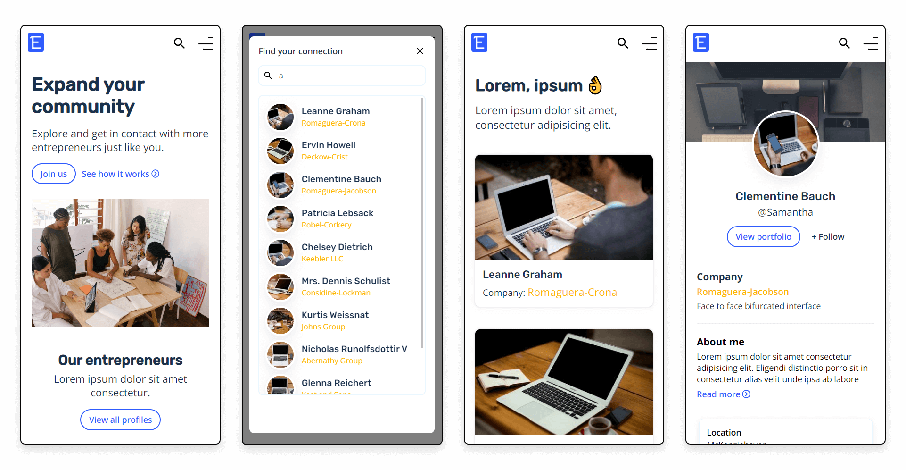
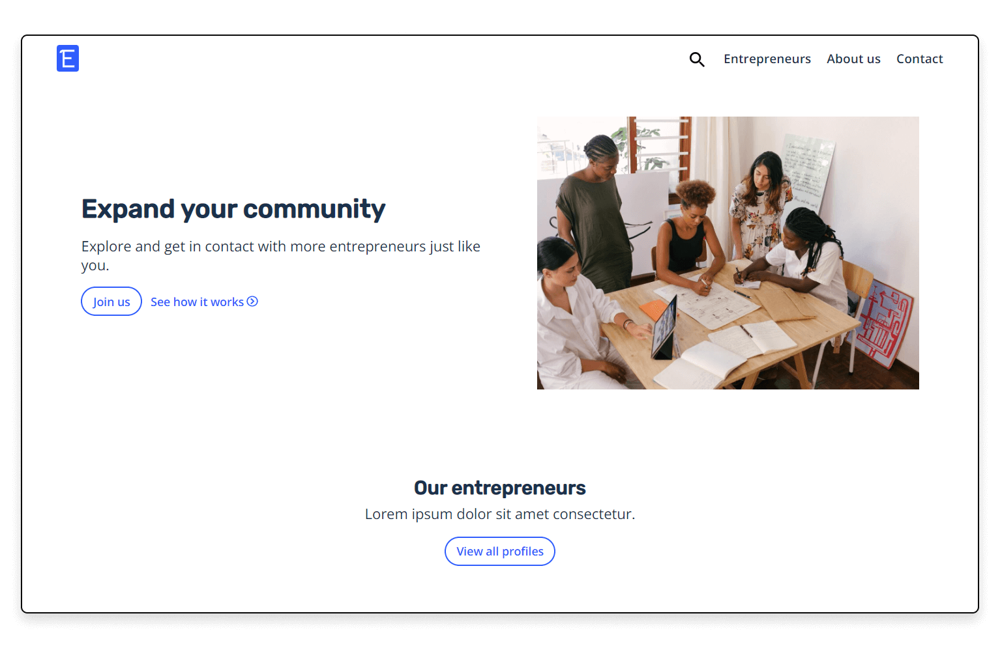

# Entrepreneurs

Web app - Testing JSONPlaceholder API

## Technologies used

• HTML
• SASS
• JavaScript
• React
• React Router

## A preview of the project

#

_`Search functionality has not been implemented yet`_

#

**Note:**
when developing web pages I always start with the mobile version and once all its functionalities are ready, I continue with the remaining versions that would be tablet and laptop.
